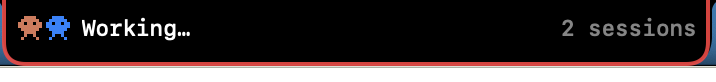
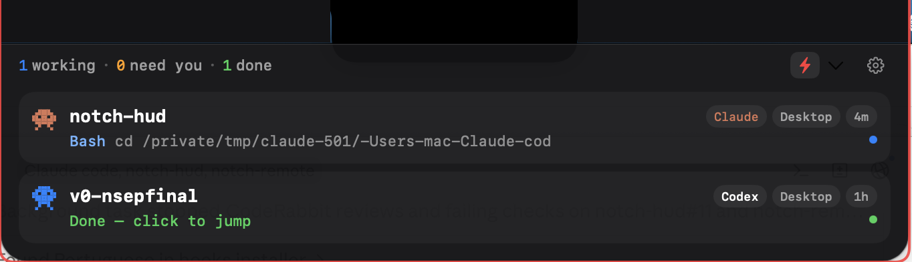
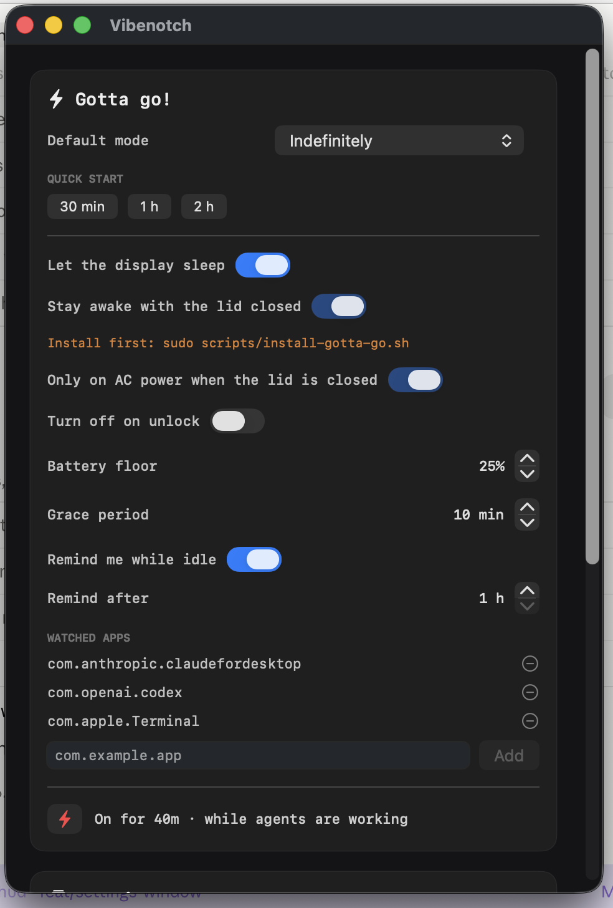

# Vibenotch

**A live HUD for your AI coding agents, parked in the MacBook notch.**

Vibenotch watches your Claude Code and Codex sessions and shows what each one
is doing — **working**, **needs you**, **done** — right where you're already
looking.



Hover it and the notch expands into a panel with every session: which project,
which agent, which model, what tool it just ran. Click a row and the terminal
or desktop app that owns that session comes to the front.



The red outline in both shots is **Gotta go!** — the keep-awake mode — telling
you the Mac will not fall asleep while your agents are still working.

---

## Contents

- [What this is, and what it was](#what-this-is-and-what-it-was)
- [What Vibenotch adds](#what-vibenotch-adds)
  - [Codex support](#1-codex-support-cli-and-desktop)
  - [Gotta go!](#2-gotta-go--the-lid-closed-problem)
  - [Phone companion](#3-phone-companion)
  - [Settings](#4-a-real-settings-window)
  - [Follows your language](#5-follows-your-devices-language)
  - [One-command install](#6-one-command-install)
- [Install](#install)
- [How it works](#how-it-works)
- [Every option](#every-option)
- [Uninstall](#uninstall)
- [Troubleshooting](#troubleshooting)
- [Credits and licensing](#credits-and-licensing)

---

## What this is, and what it was

Vibenotch is an adaptation of **[coopersimson96/notch-hud](https://github.com/coopersimson96/notch-hud)**,
which built the foundation: the notch geometry and window management, the
Claude Code session HUD, click-to-focus, and inline approval cards. All of
that is still here and still theirs.

Everything in the next section is what got added on top.

---

## What Vibenotch adds

### 1. Codex support (CLI and desktop)

The original watched Claude Code. Vibenotch watches **Codex** too, and it took
three different mechanisms because Codex reports itself three different ways:

- **A `notify` adapter.** Codex can call an external program when a turn ends
  or an approval is needed. `vibenotch-codex-notify` translates that payload
  into a session card — `done` on turn-end, `needs me` on an approval request.
  It is installed *additively*: if you already had a `notify` program
  configured, yours still runs (chained), and `~/.codex/config.toml` is backed
  up with a timestamp before anything is written.
- **A `codex` PATH shim.** `notify` only fires at the *end* of a turn, so a
  session would appear only once it was already finished. The shim wraps the
  real `codex` binary and emits `working` the moment you start, `done` when
  the process exits. (It guards against wrapping itself — a shim that finds
  itself on `PATH` again is a fork bomb, so it walks past its own inode.)
- **A rollout-file poller** for **Codex desktop**, which uses neither of the
  above. Vibenotch reads `~/.codex/sessions/**/rollout-*.jsonl` and derives
  the session from it.

Sessions from a desktop app get a **Desktop** chip so you can tell them apart
from terminal ones, and the sprite is colour-coded: **orange for Claude, blue
for Codex**.

**Subagents count.** When Codex delegates to subagents, the parent turn looks
finished from the outside. Vibenotch follows `parent_thread_id` in the rollout
files and keeps the session as *working* while its children are still running,
instead of declaring victory early.

### 2. Gotta go! — the lid-closed problem

The thing that actually breaks long agent runs: **you close the lid and macOS
suspends everything.** Your agent stops mid-task.

**Gotta go!** is the fix — think Amphetamine, but it knows what your agents are
doing. Toggle it from the bolt in the notch, and the whole notch gets a thin
red outline so you can never wonder whether it's on.

Modes:

| Mode | Stays awake… |
|---|---|
| **While agents are working** | until every session is done, plus a grace period |
| **While the apps are open** | as long as Claude / Codex / your chosen apps are running |
| **Indefinitely** | until you turn it off |
| **Timer** | 30 min / 1 h / 2 h, one tap |

It is deliberately hard to leave running by accident:

- **Battery floor.** On battery, it releases below your threshold rather than
  flattening the machine.
- **Grace period.** A pause between prompts doesn't count as "done".
- **Turn off on unlock.** Back at the keyboard, it stands down.
- **Idle reminder.** Still on hours later with nothing running? It tells you.

**Closed-lid** support needs one extra step, because keeping a MacBook awake
with the lid shut requires `pmset -a disablesleep`, which is root-only. The
installer adds a sudoers rule scoped to **exactly two commands** — nothing
else, validated with `visudo -c` before it's ever active:

```text
<you> ALL=(root) NOPASSWD: /usr/bin/pmset -a disablesleep 1, /usr/bin/pmset -a disablesleep 0
```

A LaunchAgent watchdog runs every 60s and turns `disablesleep` back **off** if
Vibenotch isn't running — so a crash can't leave your Mac permanently unable
to sleep.

### 3. Phone companion

An optional PWA you add to your phone's home screen ([notch-remote](https://github.com/rebelpaulo/notch-remote)):

- **See and control Gotta go! from anywhere.** Toggle it on or off remotely;
  the two sides reconcile in both directions, so flipping the bolt on the Mac
  updates the phone and vice versa (a local change always wins over a stale
  remote one).
- **Change the settings** from the phone — default mode, battery floor, grace
  period, closed-lid, the lot.
- **Push notifications** for battery thresholds (50 / 30 / 20 %), for "an agent
  needs you", and for "all agents finished".

It's your own deployment (Vercel + Supabase + a shared secret you choose), not
a service anyone else runs.

### 4. A real Settings window



Everything is adjustable in one place — modes, quick-start timers, thresholds,
which apps count as "an agent is running", the pairing status of the phone, and
a test-push button.

### 5. Follows your device's language

English and Portuguese, chosen from the system language, on both the Mac app
and the phone app. English is the source language; a missing translation falls
back to English rather than to a key name.

### 6. One-command install

`scripts/install.sh` builds the app, installs it, wires up the Claude Code
hooks and the Codex adapter, and can undo all of it. Every change to a file
you own — `~/.claude/settings.json`, `~/.codex/config.toml`, `~/.zshrc` — is
**additive** and backed up with a timestamped `.bak` first.

---

## Install

**Requirements:** macOS 14+, Xcode Command Line Tools (`xcode-select --install`),
and `jq` (`brew install jq`). A MacBook with a notch is ideal; without one the
app falls back to a floating pill.

```bash
git clone https://github.com/rebelpaulo/notch-hud.git
cd notch-hud
./scripts/install.sh
```

That builds `Vibenotch.app`, installs it to `/Applications`, puts the helper
scripts in `~/.vibenotch/bin`, merges the five Claude Code hooks into
`~/.claude/settings.json`, and installs the Codex adapter.

Flags: `--yes` (no prompts), `--skip-claude-hooks`, `--skip-codex`,
`--uninstall`.

**Then, for closed-lid Gotta go! (optional, needs sudo):**

```bash
sudo scripts/install-gotta-go.sh
```

**Then restart your agents.** Claude Code reads its hooks at startup, and the
`codex` shim is picked up by new shells.

### Phone companion (optional)

See [notch-remote](https://github.com/rebelpaulo/notch-remote) for deploying
your own instance. Pairing is a single file:

```bash
mkdir -p ~/.vibenotch
cat > ~/.vibenotch/remote.json <<'JSON'
{"url": "https://your-deployment.vercel.app", "secret": "your-shared-secret"}
JSON
```

Open the same URL on your phone, paste the same secret, and add it to the home
screen.

---

## How it works

There is no daemon and no IPC. Everything goes through a **spool directory** of
small JSON files:

```text
~/.vibenotch/sessions/<agent>-<id>.json
```

- **Claude Code hooks** (`UserPromptSubmit`, `PreToolUse`, `Stop`,
  `Notification`, `SessionEnd`) call `vibenotch-claude-hook`, which writes the
  session's current state.
- **Codex** writes through the `notify` adapter, the PATH shim, and the
  rollout poller described above.
- **The app** watches that directory and renders it.

Writes are atomic (temp file + rename) and carry a sequence number, so a slow
writer can't overwrite a newer state. Anything that stops updating is marked
unknown after 90 s and dropped after 15 min.

Click-to-focus supports Terminal.app, iTerm2, kitty, WezTerm, and the Claude
and Codex desktop apps.

---

## Every option

| Setting | What it does | Default |
|---|---|---|
| **Default mode** | What the bolt turns on: while agents work / while apps are open / indefinitely | while agents work |
| **Quick start** | One-tap 30 min, 1 h, 2 h timers | — |
| **Let the display sleep** | Keeps the machine awake but lets the screen go dark | on |
| **Stay awake with the lid closed** | Needs `sudo scripts/install-gotta-go.sh` | off |
| **Only on AC power when the lid is closed** | Refuses closed-lid on battery | on |
| **Turn off on unlock** | Stands down when you're back | off |
| **Battery floor** | Releases below this charge (10–50 %) | 20 % |
| **Grace period** | How long "no agents working" must last before it stops (0–60 min) | 10 min |
| **Remind me while idle** | Notifies if it's been on with nothing running | off |
| **Remind after** | How long before that reminder (1–12 h) | 1 h |
| **Watched apps** | Bundle IDs that count as "an agent is running" | Claude, Codex, Terminal |

Session cards: a session with no update for **90 s** goes unknown; after
**15 min** its card is dropped. Clicking a finished session opens it and clears
the card.

---

## Uninstall

```bash
./scripts/install.sh --uninstall
```

Removes the app, the scripts and the Claude Code hooks (leaving unrelated hooks
alone). It deliberately does **not** touch the sudoers rule, the LaunchAgent or
your phone pairing file — it tells you where they are so you can remove them
yourself.

---

## Troubleshooting

**Sessions don't appear.** Restart your agent after installing — Claude Code
reads hooks at startup. Check the spool is being written:
`ls ~/.vibenotch/sessions`.

**Clicking a row doesn't raise the window.** macOS asks for Automation
permission the first time; the card offers a button that opens the right
settings pane.

**"Install first: sudo scripts/install-gotta-go.sh".** Closed-lid mode is
unavailable until that runs.

**The Mac still sleeps with the lid closed.** Check the assertion is live:
`pmset -g assertions | grep "Gotta go"`. Note that closed-lid mode refuses to
engage on battery unless you turn off *Only on AC power*.

**The app is in the wrong language.** It follows the system language. To force
one: System Settings → General → Language & Region → Applications → add
Vibenotch.

---

## Credits and licensing

**Built on [coopersimson96/notch-hud](https://github.com/coopersimson96/notch-hud)**
by Cooper Simson — the notch HUD foundation, the Claude Code session model,
click-to-focus and the inline approval cards come from that project. Vibenotch
is a fork that adds Codex support, Gotta go!, the phone companion, the settings
window, localization and the installer.

**[DynamicNotchKit](https://github.com/MrKai77/DynamicNotchKit)** by Kai Azim,
vendored under `vendor/`, MIT licensed — see `vendor/DynamicNotchKit/LICENSE`.

**Licensing note:** the upstream project does not publish a license, so it is
"all rights reserved" by default. This repository is a **GitHub fork**, which
is what GitHub's Terms of Service permit for public repositories — it is not a
re-upload. If you want to redistribute this code anywhere else, ask the
upstream author for a license first.
