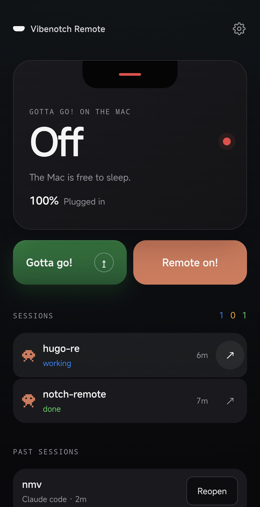
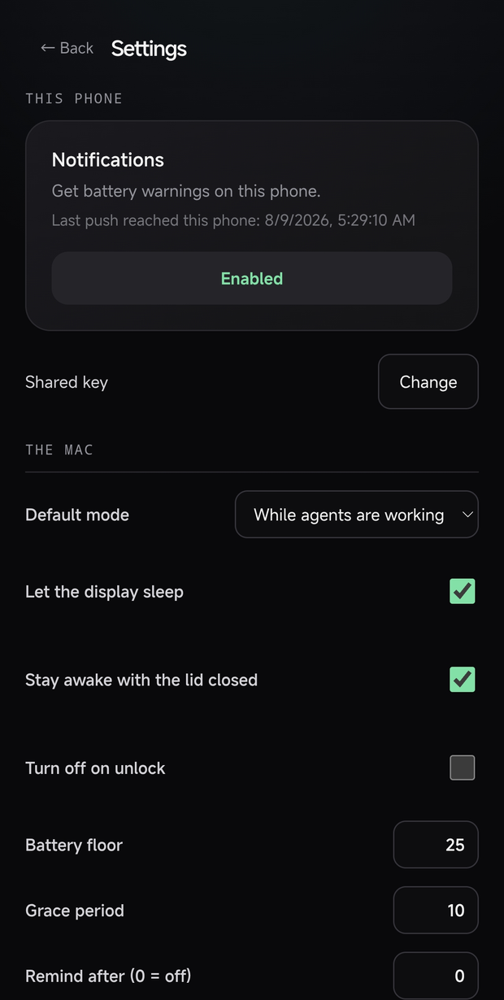

# Vibenotch

**A live HUD for your AI coding agents, parked in the MacBook notch.**

Vibenotch watches your Claude Code and Codex sessions and shows what each one
is doing — **working**, **needs you**, **done** — right where you're already
looking.


Hover it and the notch expands into a panel with every session: which project,
which agent, which model, what tool it just ran. Click a row and the terminal
or desktop app that owns that session comes to the front.


*This screenshot predates the quota tab and its gauge button beside the bolt.*

The red outline in both shots is **Gotta go!** — the keep-awake mode — telling
you the Mac will not fall asleep while your agents are still working.

---

## Contents

- [What this is, and what it was](#what-this-is-and-what-it-was)
- [What Vibenotch adds](#what-vibenotch-adds)
  - [Codex support](#1-codex-support-cli-and-desktop)
  - [Gotta go!](#2-gotta-go--the-lid-closed-problem)
  - [Quota gauges and token history](#3-quota-gauges-and-token-history)
  - [Phone companion](#4-phone-companion)
  - [Settings](#5-a-real-settings-window)
  - [Follows your language](#6-follows-your-devices-language)
  - [One-command install](#7-one-command-install)
- [Install](#install)
- [How it works](#how-it-works)
- [Every option](#every-option)
- [Uninstall](#uninstall)
- [Troubleshooting](#troubleshooting)
- [Credits and licensing](#credits-and-licensing)

---

## What this is, and what it was

Vibenotch is an adaptation of **[coopersimson96/notch-hud](https://github.com/coopersimson96/notch-hud)**,
which built the foundation: the notch geometry and window management, the
Claude Code session HUD, click-to-focus, and inline approval cards. All of
that is still here and still theirs.

Everything in the next section is what got added on top.

---

## What Vibenotch adds

### 1. Codex support (CLI and desktop)

The original watched Claude Code. Vibenotch watches **Codex** too, and it took
three different mechanisms because Codex reports itself three different ways:

- **A `notify` adapter.** Codex can call an external program when a turn ends
  or an approval is needed. `vibenotch-codex-notify` translates that payload
  into a session card — `done` on turn-end, `needs me` on an approval request.
  It is installed *additively*: if you already had a `notify` program
  configured, yours still runs (chained), and `~/.codex/config.toml` is backed
  up with a timestamp before anything is written.
- **A `codex` PATH shim.** `notify` only fires at the *end* of a turn, so a
  session would appear only once it was already finished. The shim wraps the
  real `codex` binary and emits `working` the moment you start, `done` when
  the process exits. (It guards against wrapping itself — a shim that finds
  itself on `PATH` again is a fork bomb, so it walks past its own inode.)
- **A rollout-file poller** for **Codex desktop**, which uses neither of the
  above. Vibenotch reads `~/.codex/sessions/**/rollout-*.jsonl` and derives
  the session from it.

Sessions from a desktop app get a **Desktop** chip so you can tell them apart
from terminal ones, and the sprite is colour-coded: **orange for Claude, blue
for Codex**.

**Subagents count.** When Codex delegates to subagents, the parent turn looks
finished from the outside. Vibenotch follows `parent_thread_id` in the rollout
files and keeps the session as *working* while its children are still running,
instead of declaring victory early.

### 2. Gotta go! — the lid-closed problem

The thing that actually breaks long agent runs: **you close the lid and macOS
suspends everything.** Your agent stops mid-task.

**Gotta go!** is the fix — think Amphetamine, but it knows what your agents are
doing. Toggle it from the bolt in the notch, and the whole notch gets a thin
red outline so you can never wonder whether it's on.

Modes:

| Mode | Stays awake… |
|---|---|
| **While agents are working** | until every session is done, plus a grace period |
| **While the apps are open** | as long as Claude / Codex / your chosen apps are running |
| **Indefinitely** | until you turn it off |
| **Timer** | 30 min / 1 h / 2 h, one tap |

It is deliberately hard to leave running by accident:

- **Battery floor.** On battery, it releases below your threshold rather than
  flattening the machine.
- **Grace period.** A pause between prompts doesn't count as "done".
- **Turn off on unlock.** Back at the keyboard, it stands down.
- **Idle reminder.** Still on hours later with nothing running? It tells you.

Gotta go! watches the thermal-pressure verdict from macOS. At **serious**
or **critical**, the notch shows a thermometer and sends the same state to the
phone. At critical pressure, Gotta go! turns itself off. Vibenotch only reads
the verdict: firmware controls the fans, and macOS exposes no API that can
change their speed.

A closed MacBook tends to run hotter because its exhaust vents into a closed
clamshell, while the machine loses the display back and top case as places to
radiate heat.

**Closed-lid** support needs one extra step, because keeping a MacBook awake
with the lid shut requires `pmset -a disablesleep`, which is root-only. The
installer adds a sudoers rule scoped to **exactly two commands** — nothing
else, validated with `visudo -c` before it's ever active:

```text
<you> ALL=(root) NOPASSWD: /usr/bin/pmset -a disablesleep 1, /usr/bin/pmset -a disablesleep 0
```

A LaunchAgent watchdog runs every 60s and turns `disablesleep` back **off** if
Vibenotch isn't running — so a crash can't leave your Mac permanently unable
to sleep.

### 3. Quota gauges and token history

The gauge button beside the bolt opens a second tab in the notch panel,
replacing the session list with Claude, Codex and Grok quota gauges. Each
provider gets whatever windows it reports — session and weekly for Claude,
weekly for Codex and Grok — with model-scoped limits in a compact list below.
If you are not signed in to a provider, Vibenotch leaves it out: no empty card
and no "unavailable" badge.

The cards are collapsible, one open at a time. Collapsed, a card shows its
provider and its first window; the rest and the daily chart are a click away.
Three providers each with a month of history is not something you take in at a
glance.

The numbers come from endpoints the CLIs already authenticate against. For
Claude, Vibenotch reads the OAuth token that Claude Code stores in the macOS
Keychain item `Claude Code-credentials`, then calls Claude's OAuth usage
endpoint. macOS may ask for Keychain authorisation the first time. For Codex,
it reads `~/.codex/auth.json` and calls the ChatGPT backend usage endpoint. For
Grok, it reads `~/.grok/auth.json` and calls the Grok CLI's billing endpoint;
that one also needs an `x-xai-token-auth` header, and answers 401 without
explanation if you omit it.

None of the three endpoints is documented, and any of them can change shape
without notice. For Claude and Codex, Vibenotch drops a window when a field is
missing or unbelievable: a 0% gauge built from bad data would be worse than no
gauge. It classifies windows by how long they last, never by which slot they
occupy; OpenAI puts the seven-day window in `primary_window` on some accounts.

Grok is the deliberate exception, and it is worth knowing why. Its payload is
protobuf underneath, and proto3 omits any field whose value is zero — so an
absent percentage there means 0%, not unknown. Applying the other rule would
blank the Grok card exactly when you have used nothing, which is when an empty
bar is both true and reassuring.

A thin stripe across each bar marks the share that a linear, even spend would
have used by now. It turns red when you are ahead of that pace and green when
you are not. The comparison gives an 85% reading its missing context: whether
you are ahead of schedule and heading to run out before the reset.

Below each provider's gauges, Vibenotch draws a per-day token history from the
logs both CLIs already write under `~/.claude/projects` and
`~/.codex/sessions`. This needs no API or authentication. The first scan has
to walk the existing history; one 3.4 GB history took about three minutes.
Vibenotch caches the result under `~/Library/Caches`, so later scans take a
fraction of a second.

The history reports token counts. Both accounts used here are subscriptions,
so there is no per-token charge to report. Turning the counts into dollars
would mean inventing a bill from API list prices.

### 4. Phone companion

An optional PWA you add to your phone's home screen ([notch-remote](https://github.com/rebelpaulo/notch-remote)):

- **See and control Gotta go! from anywhere.** Toggle it on or off remotely;
  the two sides reconcile in both directions, so flipping the bolt on the Mac
  updates the phone and vice versa (a local change always wins over a stale
  remote one).
- **See what the agents are doing** — the same session list the notch shows,
  with the same sprites and status colours, so "which one needs me?" has an
  answer from the sofa. A list that stops being updated dims and freezes
  rather than going on claiming work is still running.
- **Check quota and token history.** A quota button beside the settings gear
  opens the same Claude, Codex and Grok gauges, plus a per-day token chart. The phone
  hides quota data older than 30 minutes rather than presenting it as current.
- **Reopen a past conversation.** A conversation the Claude app shows as
  *Disconnected* has no way back from the phone — only from the machine it ran
  on. Tapping **Reopen** asks the Mac to run `claude --remote-control --resume`
  for it, which is what brings Remote Control back with the history intact.
- **Start or stop a Remote Control server** with **Remote on / Remote off**,
  which is what puts the Mac under *Devices* in the Claude app so new sessions
  can be started from the phone. The button shows which state you are in.
- **Tap a live session** to bring the agent's own app to the front — the Claude
  app or the Codex app, whichever is running it.
- **The Mac's battery and thermal state**, so "is it about to die or getting
  too hot?" does not require walking over to look.
- **The last 20 alerts**, so "what did I miss?" still has an answer after the
  phone's notification shade has cleared itself.
- **Change the settings** from the phone, split by which machine they change:
  *this phone* (notifications) and *the Mac* (default mode, battery floor,
  grace period, closed-lid, the lot).
- **Push notifications** for battery thresholds (50 / 30 / 20 %), for "an agent
  needs you", and for "all agents finished".

A request from the phone carries an opaque id and an action from a fixed list
— never a path, a command or an argument. The Mac resolves that id against
conversations it indexed and published itself and builds the command, so an id
it never published is refused. That bound applies to the resume command
specifically: it cannot be steered into running something of the caller's
choosing.

**Treat the pairing secret as a credential to your Mac.** Anyone holding it can
do everything the phone can: turn Gotta go! on or off, change the Mac-side
settings, start or stop a Remote Control server, and read the session and
conversation metadata listed below. It is a bearer token with no second factor,
so keep it out of screenshots and shared notes, and change it (in Vercel and in
`~/.vibenotch/remote.json`) if it ever leaks.

What leaves your Mac is deliberately narrow: project name, agent, status,
start time, subagent count, and a per-session id that is a keyed digest, not
the session's own identifier — the key is generated once on your machine and
never published, so nobody holding the digest can work back to the id. Never
your prompts, the tool lines, or the paths you work in.

<p>
  
  
</p>

*The first phone screenshot predates the quota tab and its button beside
Settings.*

It's your own deployment (Vercel + Supabase + a shared secret you choose), not
a service anyone else runs.

### 5. A real Settings window


Everything is adjustable in one place — modes, quick-start timers, thresholds,
which apps count as "an agent is running", the pairing status of the phone, and
a test-push button.

### 6. Follows your device's language

English and Portuguese, chosen from the system language, on both the Mac app
and the phone app. English is the source language; a missing translation falls
back to English rather than to a key name.

### 7. One-command install

`scripts/install.sh` builds the app, installs it, wires up the Claude Code
hooks and the Codex adapter, and can undo all of it. Every change to a file
you own — `~/.claude/settings.json`, `~/.codex/config.toml`, `~/.zshrc` — is
**additive** and backed up with a timestamped `.bak` first.

---

## Install

**Requirements:** macOS 14+, Xcode Command Line Tools (`xcode-select --install`),
and `jq` (`brew install jq`). A MacBook with a notch is ideal; without one the
app falls back to a floating pill.

```bash
git clone https://github.com/rebelpaulo/notch-hud.git
cd notch-hud
./scripts/install.sh
```

That builds `Vibenotch.app`, installs it to `/Applications`, puts the helper
scripts in `~/.vibenotch/bin`, merges the five Claude Code hooks into
`~/.claude/settings.json`, installs the Codex adapter, and restarts Vibenotch so
an already-running process cannot keep using the previous binary.

### Updates

Vibenotch checks the repository's latest published GitHub release when it
starts and every six hours while it remains open. When a newer semantic
version exists, the sessions panel shows a **Vibenotch · Version … available**
card. Clicking it opens Terminal, downloads that exact tagged release, verifies
its signed checksum, runs `scripts/install.sh --yes`, and restarts the app after
the app bundle, hooks, and helper scripts have all been refreshed.

The release tag is strictly validated before it reaches the shell; update
commands are not read from the network. The updater accepts only tags shaped
like `v1.2.3`, always downloads from `rebelpaulo/notch-hud` over HTTPS, and
refuses to extract or execute an archive unless its checksum manifest was
signed by Vibenotch's embedded release key.

Versions installed before this checker existed cannot discover it
retroactively. Those users need one final manual update from their checkout:

```bash
git pull
./scripts/install.sh --yes
```

After that bootstrap update, future releases appear in the notch itself.

#### Publishing a release

Maintainers must bump the version in `Sources/Vibenotch/Info.plist` and
`scripts/make-app.sh`, merge it, and create a matching tag. From that clean,
tagged commit, build the signed assets with:

```bash
./scripts/package-release.sh v0.4.0
gh release create v0.4.0 dist/v0.4.0/* --title "Vibenotch 0.4.0"
```

The dedicated private key defaults to
`~/Library/Application Support/Vibenotch/release-signing-private.pem`. It must
be backed up securely and never committed. The packaging script fails if the
key does not match `scripts/release-signing-public.pem`; the updater fails
closed if any of the archive, manifest, or signature is missing or invalid.

Flags: `--yes` (no prompts), `--skip-claude-hooks`, `--skip-codex`,
`--uninstall`.

**Then, for closed-lid Gotta go! (optional, needs sudo):**

```bash
sudo scripts/install-gotta-go.sh
```

**Then restart your agents.** Claude Code reads its hooks at startup, and the
`codex` shim is picked up by new shells.

### Phone companion (optional)

See [notch-remote](https://github.com/rebelpaulo/notch-remote) for deploying
your own instance. Pairing is a single file:

```bash
mkdir -p -m 700 ~/.vibenotch
(umask 077; cat > ~/.vibenotch/remote.json <<'JSON'
{"url": "https://your-deployment.vercel.app", "secret": "your-shared-secret"}
JSON
)
```

That file holds the bearer credential for your deployment — the `umask` keeps
it out of reach of other accounts on the machine.

Open the same URL on your phone, paste the same secret, and add it to the home
screen.

---

## How it works

Session tracking uses no daemon or IPC. It goes through a **spool directory**
of small JSON files:

```text
~/.vibenotch/sessions/<agent>-<id>.json
```

- **Claude Code hooks** (`UserPromptSubmit`, `PreToolUse`, `Stop`,
  `Notification`, `SessionEnd`) call `vibenotch-claude-hook`, which writes the
  session's current state.
- **Codex** writes through the `notify` adapter, the PATH shim, and the
  rollout poller described above.
- **The app** watches that directory and renders it.

Quota data follows the separate authenticated path described above. Token
history stays on the Mac: Vibenotch scans the CLI session logs and reads its
own cache on later passes.

Writes are atomic (temp file + rename) and carry a sequence number, so a slow
writer can't overwrite a newer state. Anything that stops updating is marked
unknown after 90 s and dropped after 15 min.

Click-to-focus supports Terminal.app, iTerm2, kitty, WezTerm, and the Claude
and Codex desktop apps.

---

## Every option

| Setting | What it does | Default |
|---|---|---|
| **Default mode** | What the bolt turns on: while agents work / while apps are open / indefinitely | while agents work |
| **Quick start** | One-tap 30 min, 1 h, 2 h timers | — |
| **Let the display sleep** | Keeps the machine awake but lets the screen go dark | on |
| **Stay awake with the lid closed** | Needs `sudo scripts/install-gotta-go.sh` | off |
| **Only on AC power when the lid is closed** | Refuses closed-lid on battery | on |
| **Turn off on unlock** | Stands down when you're back | off |
| **Battery floor** | Releases below this charge (10–50 %) | 20 % |
| **Grace period** | How long "no agents working" must last before it stops (0–60 min) | 10 min |
| **Remind me while idle** | Notifies if it's been on with nothing running | off |
| **Remind after** | How long before that reminder (1–12 h) | 1 h |
| **Watched apps** | Bundle IDs that count as "an agent is running" | Claude, Codex, Terminal |

Session cards: a session with no update for **90 s** goes unknown; after
**15 min** its card is dropped. Clicking a finished session opens it and clears
the card.

---

## Uninstall

```bash
./scripts/install.sh --uninstall
```

Removes the app, the scripts and the Claude Code hooks (leaving unrelated hooks
alone). It deliberately does **not** touch the sudoers rule, the LaunchAgent or
your phone pairing file — it tells you where they are so you can remove them
yourself.

---

## Troubleshooting

**Sessions don't appear.** Restart your agent after installing — Claude Code
reads hooks at startup. Check the spool is being written:
`ls ~/.vibenotch/sessions`.

**Clicking a row doesn't raise the window.** macOS asks for Automation
permission the first time; the card offers a button that opens the right
settings pane.

**"Install first: sudo scripts/install-gotta-go.sh".** Closed-lid mode is
unavailable until that runs.

**The Mac still sleeps with the lid closed.** Check the assertion is live:
`pmset -g assertions | grep "Gotta go"`. Note that closed-lid mode refuses to
engage on battery unless you turn off *Only on AC power*.

**The app is in the wrong language.** It follows the system language. To force
one: System Settings → General → Language & Region → Applications → add
Vibenotch.

**A quota gauge is missing.** Sign in through that provider's CLI first. The
Claude gauge may trigger a one-time Keychain prompt. Vibenotch also hides a
window when the undocumented endpoint omits a field or returns an implausible
value, rather than turning suspect data into 0%.

---

## Credits and licensing

**Built on [coopersimson96/notch-hud](https://github.com/coopersimson96/notch-hud)**
by Cooper Simson — the notch HUD foundation, the Claude Code session model,
click-to-focus and the inline approval cards come from that project. Vibenotch
is a fork that adds Codex support, Gotta go!, quota and token views, thermal
awareness, the phone companion, the settings window, localization and the
installer.

**[DynamicNotchKit](https://github.com/MrKai77/DynamicNotchKit)** by Kai Azim,
vendored under `vendor/`, MIT licensed — see `vendor/DynamicNotchKit/LICENSE`.

**Licensing note:** the upstream project does not publish a license, so it is
"all rights reserved" by default. This repository is a **GitHub fork**, which
is what GitHub's Terms of Service permit for public repositories — it is not a
re-upload. If you want to redistribute this code anywhere else, ask the
upstream author for a license first.
